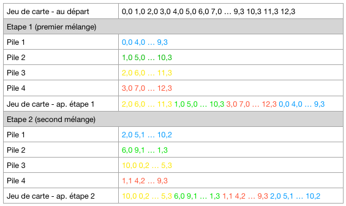

# Mix of cards / Documentation EN

## Presentation

* Language : Python
* Platform : Gamebuino META
* Description : function to mix a set of 52 cards
* Core function : `mixCards`

## Commands

While the cards are being displayed :

* Button Left / Right : show other cards
* Button Menu : show current mixes number
* Button A : perform a card shuffling operation

During the display of the number of mixes :

* Button Menu : show cards

## Explanations

For each shuffling operation :

* The cards are divided into four sub decks of cards.
* You assemble your four sub decks such that the resulting deck of cards is the concatenation of sub deck 3, 2, 4, then 1.

Here is an overview of two mixing operations :



## Code of core function

```
def mixCards():
	subSet1 = []
	subSet2 = []
	subSet3 = []
	subSet4 = []
	# Mix cards
	for i in range(52):
		s = i % 4
		if s == 0:
			subSet1.append(cards[i])
		elif s == 1:
			subSet2.append(cards[i])
		elif s == 2:
			subSet3.append(cards[i])
		else:
			subSet4.append(cards[i])
	# Re-order cards
	n = 0
	for s in range(4):
		subSet = subSet1
		if s == 0:
			subSet = subSet3
		elif s == 1:
			subSet = subSet2
		elif s == 2:
			subSet = subSet4
		for c in range(13):
			cards[n] = subSet[c]
			n += 1
	game['nbMix'] += 1
```

Note : the last line `game['nbMix'] += 1` is only useful for this demonstration program.
